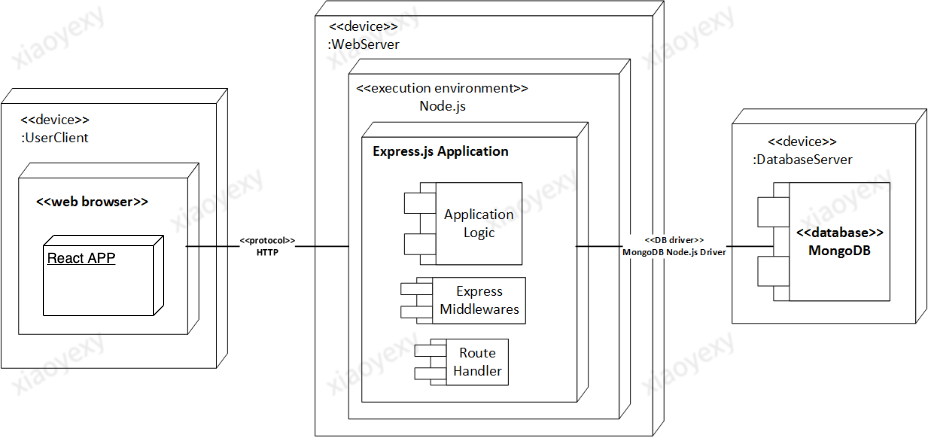

# Feedback Collection Web App

It's a web application that provides customers with mass survey delivery as well as advanced reports on received feedbacks. It implementes the full gamut of features, including user authentication, payment handling, email delivery, and report generation.

## Deployment Diagram

**Frontend** is implemented in [React](https://github.com/facebook/create-react-app), Redux, JavaScript, HTML5 and CSS.

**Backend** is implemented in Node.js and Express.js

**Database** is Mongodb 4.4.6.

**Involved third-party APIs**: sendGrid API, Stripe API, Google OAuth authentication, Heroku API.

<!-- [Heroku repo](https://git.heroku.com/shielded-oasis-79598.git)

[Heroku Application](https://shielded-oasis-79598.herokuapp.com) -->
